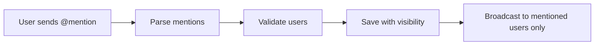

# 💬 SlashChat

A modern, real-time messaging application with advanced private mention capabilities within group chats. Built with React, Node.js, Socket.IO, and MongoDB.


## ✨ Features

### 🎯 Core Functionality
- **Real-time Messaging**: Instant message delivery powered by Socket.IO
- **Group Chats**: Create and manage group conversations
- **Private Mentions**: Send private messages within group chats using @mentions
- **User Authentication**: Secure JWT-based authentication
- **Message History**: Persistent conversation storage with MongoDB
- **Responsive Design**: Beautiful UI with dark mode support

### 🔒 Advanced Privacy Features
- **Selective Message Visibility**: Messages with @mentions are only visible to mentioned users
- **Database-Level Privacy**: Privacy enforced at the database layer
- **Group Membership Validation**: Only actual group members can be mentioned
- **Visual Indicators**: Clear UI indicators for private mentions

## 🏗️ Architecture

```
SlashChat/
├── client/                 # React frontend
│   ├── src/
│   │   ├── components/    # React components
│   │   ├── utils/         # Utility functions
│   │   └── App.jsx        # Main application
│   └── package.json
│
├── server/                 # Node.js backend
│   ├── models/            # Database models
│   ├── utils/             # Server utilities
│   │   └── socket.js      # Socket.IO handlers
│   ├── scripts/           # Database scripts
│   └── server.js          # Express server
│
└── README.md
```

## 🚀 Getting Started

### Prerequisites

- Node.js (v14.0.0 or higher)
- MongoDB (v4.0 or higher)
- npm or yarn

### Installation

1. **Clone the repository**
   ```bash
   git clone https://github.com/yourusername/slashchat.git
   cd slashchat
   ```

2. **Install server dependencies**
   ```bash
   cd server
   npm install
   ```

3. **Install client dependencies**
   ```bash
   cd ../client
   npm install
   ```

4. **Configure environment variables**
   
   Create a `.env` file in the `server` directory:
   ```env
   JWT_SECRET_KEY=your_secret_key_here
   CONNECTION_STRING=mongodb://localhost:27017/slashchat
   PORT=5000
   ```

5. **Set up database indexes**
   ```bash
   cd server
   node scripts/createMessageIndexes.js
   ```

6. **Start the application**
   
   Terminal 1 (Server):
   ```bash
   cd server
   npm start
   ```
   
   Terminal 2 (Client):
   ```bash
   cd client
   npm start
   ```

The application will be available at `http://localhost:3000`

## 📖 Usage

### Basic Messaging

1. **Sign up** or **log in** to your account
2. **Create a group** or join an existing one
3. **Send messages** in real-time to all group members

### Private Mentions

Send private messages within group chats by mentioning specific users:

```
@john Hey, can you help me with the report?
```

Only you and John will see this message. Other group members won't see it at all.

### Multiple Mentions

Mention multiple users for private group discussions:

```
@alice @bob Can you both review the proposal?
```

Only you, Alice, and Bob will see this message.

## 🔧 Technical Details

### Private Mention System

The private mention feature uses a sophisticated visibility system:

1. **Mention Detection**: Regex-based parsing extracts @mentions from messages
2. **User Validation**: Verifies mentioned users are actual group members
3. **Database Storage**: Messages stored with visibility metadata
4. **Selective Broadcasting**: Real-time delivery only to authorized users
5. **History Filtering**: Database-level filtering ensures privacy

### Message Flow



## 🛡️ Security Features

- **JWT Authentication**: Secure token-based authentication
- **Group Membership Enforcement**: Only group members can be mentioned
- **Database-Level Privacy**: Privacy enforced before data leaves the server
- **No Client-Side Bypasses**: All validation happens server-side
- **Secure Socket Connections**: Protected real-time communication

## 🎨 UI Components

- **MessageBubble**: Displays individual messages with sender info
- **GroupChatWindow**: Main chat interface with message list
- **Private Mention Indicator**: Visual feedback for private messages
- **Dark Mode Support**: Automatic theme switching

## 📊 Database Schema

### Messages Collection

```javascript
{
  _id: ObjectId,
  senderId: ObjectId,
  groupId: ObjectId,
  message: String,
  messageType: "group",
  mentions: [ObjectId],           // Mentioned user IDs
  visibleToUserIds: [ObjectId],   // Users who can see the message
  timestamp: Date,
  createdAt: Date,
  updatedAt: Date
}
```

## 🔌 API Reference

### Socket Events

#### Client → Server
- `sendGroupMessage`: Send a message to a group
- `joinRoom`: Join a group chat room
- `leaveRoom`: Leave a group chat room

#### Server → Client
- `groupMessageReceived`: Receive a new group message
- `userJoined`: Notification when user joins
- `userLeft`: Notification when user leaves

## 🧪 Testing

```bash
# Run server tests
cd server
npm test

# Run client tests
cd client
npm test
```

## 📈 Performance

- **Efficient Database Queries**: Optimized with proper indexing
- **Smart Socket Broadcasting**: Reduces unnecessary network traffic
- **React Optimization**: Efficient state management and re-rendering
- **Lazy Loading**: Conversation history loaded on demand

## 🤝 Contributing

Contributions are welcome! Please follow these steps:

1. Fork the repository
2. Create a feature branch (`git checkout -b feature/AmazingFeature`)
3. Commit your changes (`git commit -m 'Add some AmazingFeature'`)
4. Push to the branch (`git push origin feature/AmazingFeature`)
5. Open a Pull Request

## 📝 License

This project is licensed under the MIT License - see the [LICENSE](LICENSE) file for details.

## 👥 Authors

- **Your Name** - *Initial work* - [YourGitHub](https://github.com/yourusername)

## 🙏 Acknowledgments

- Socket.IO for real-time communication
- MongoDB for flexible data storage
- React community for amazing tools and libraries
- All contributors who help improve this project

## 📧 Contact

- Project Link: [https://github.com/yourusername/slashchat](https://github.com/yourusername/slashchat)
- Email: your.email@example.com


---

⭐ **Star this repository if you find it helpful!**
